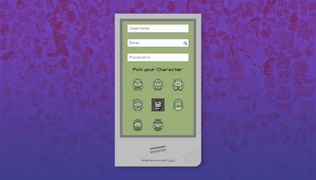

# PokémOnline

PokémOnline is a way to play Pokémon with your friends. Pokémon was played only on the Gameboy, online play wasn't available. In fact, users had to be sitting next to each other and connect with a wire to play together. With PokémOnline you can play with anyone, anywhere.

## Getting Started

### Jump right in
To play, visit our deployed link **[here](https://pokem-online.herokuapp.com/)**. Login with our test account. 

Email: `test@test.com`
Password: `password`
### Make an account
Can create your own account! We use Passport to hash and salt our passwords. On the registration page, you can create an account and pick your character.

## Built With

* [Socket.IO](https://socket.io/) - Web sockets
* [React](https://reactjs.org/) - The web framework used
* [Passport](http://www.passportjs.org/) - Authentication
* [Express](https://expressjs.com/) - Server
* [MongoDB](https://www.mongodb.com/) - Database structure
* [Mongoose](https://mongoosejs.com/) - Object modeling for MongoDB
* [Axios](https://github.com/axios/axios) - Server HTTP requests

## Authors

* **Michael McCarty** - *Authentication, sockets, deployment* - [mccartyatl](https://github.com/michaelmccarty)
* **Will West** - *Game logic* - [Jyouya](https://github.com/Jyouya)
* **Logan Miner** - *Game logic, sockets, deployment* - [lrminer](https://github.com/lrminer)
* **Rodney Smith** - *Authentication, deployment* - [smit239](https://github.com/smit239)
* **Grayson Gantek** - *Front end, React* - [graysonlee123](https://github.com/graysonlee123)

## Acknowledgments

* We got most of our sprites from [spriters-resource.com](https://www.spriters-resource.com/game_boy_gbc/pokemonredblue/)
